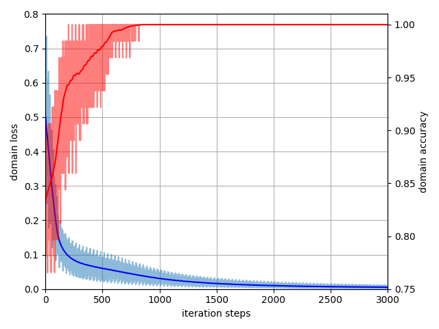

# WDGRL

**Tensorflow version: 1.3.0**

This repository contains the experiment code implemented in the paper [Wasserstein Distance Guided Representation Learning for Domain Adaptation](https://arxiv.org/abs/1707.01217). The title of the previous version was "Adversarial Representation Learning for Domain Adaptation" and we realized it was too general and thus not proper for this work.

## Toy experiment

We generate a synthetic dataset to show the superior gradient advantage of WDGRL over DANN. In the paper, we claim that when two representation distibutions are distant or have regions they differ a lot, DANN will have gradient vanishing problem while WDGRL still provide stable gradient. It is a little difficult to control such situations, so we design a rather restrictive experiment. However, this toy experiment does verify DANN may fail in some situations where WDGRL still work. The data input visualization is as follows.


The code files are in the "toy" fold. To make it simple, we create a python file for each approach: non_transfer.py for S-only, dann.py for DANN, wd.py for WDGRL. When we run the programs, we find that WDGRL can sucessfully train a classifer that works well in the target domain. DANN fails this toy experiment since the domain classifier's loss is minimized to zero and thus there is a gradient vanish problem.




**Discussions about this topic are welcomed.** 

## Amazon experiment

In amazon_baseline.py, all compared approaches are implemented. As for the MMD implementation, we mainly follow the [code](https://github.com/tensorflow/models/tree/master/research/domain_adaptation). And the WDGRL code is in the amazon_wd.py.

One can run tensorboard to visualize the training by the following command.
```bash
cd WDGRL/amazon/log
tensorboard --logdir='./'
```

## Office-Caltech experiment

In this repository, we provide three features for Office-Caltech data: Surf, GoogleNet1024, CaffeNet4096. Before we begin the experiment, we should decide which feature to use and how to split the train and test sets. By running the code data_process.py, we can generate the pkl data for each domain. The experiments will be fair if the feature to use and the train/test split are the same for each compared approaches. The results for the new train/test split may be different from the results in the paper. We provide the data we use in our experiments [here](https://drive.google.com/open?id=1apft8Ppw4WmA0SAJgy7cF1PW6-W3njtS) while we also suggest that one can generate his data if he uses a different train/test split or a different evaluation protocol.

## Deep imgae experiments

**MNIST->USPS.**
The code is in the path: digits/mnist_usps/

| Methods         |    Source Only | MMD    | CORAL | DANN | WDGRL |
| :-------- | :--------| :-- | :-- | :-- | :-- |
| Target accuracy |    89.79       |  96.77 | 96.61 |95.91 | 97.04 |
