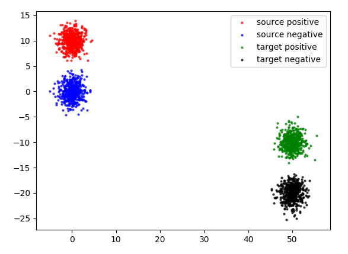

# WDGRL

This repository contains the experiment code implemented in the paper [Wasserstein Distance Guided Representation Learning for Domain Adaptation](https://arxiv.org/abs/1707.01217). The title of the previous version was "Adversarial Representation Learning for Domain Adaptation" and we realized it was too general and thus not proper for this work.

We are still working on the deep experiments of adaptation tasks on digital image datasets. Once we have some results, we will update then.

## Toy experiment

We generate a synthetic dataset to show the superior gradient advantage of WDGRL over DANN. In the paper, we claim that when two representation distibutions are distant or have regions they differ a lot, DANN will have gradient vanishing problem while WDGRL still provide stable gradient. It is a little difficult to control such situations, so we design a rather restrictive experiment. However, this toy experiment does verify DANN may fail in some situations where WDGRL still work. The data input visualization is as follows.

The code files are in the "toy" fold. To make it simple, we create a python file for each approach: non_transfer.py for S-only, dann.py for DANN, wd.py for WDGRL. When we run the programs, we find that WDGRL can sucessfully train a classifer that works well in the target domain.

**Discussions about this topic are welcomed.** 